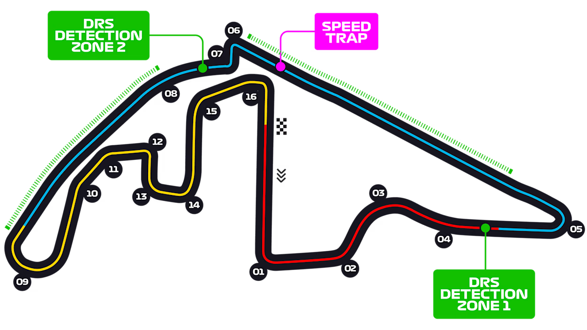

# Bayesian Analysis of F1 Telemetry and Lap Data

## UBC STAT 405 Project (Bayesian Statistics)

We will be looking into the Telemetry and Lap data an Formula One Grand Prix. For consistency between main and backup data we will be analyzing data for the 58 Laps of the **2023 Abu Dhabi Grand Prix** held on _26 November 2023_ at the _**Yas Marina Circuit**_ in **Abu Dhabi, United Arab Emirates**.

*Yas Marina Circuit Map*

The main data is sourced from an unofficial, community-operated project, called OpenF1 API _[[1]](#data-sources/)_, that is able to access live telemetry, timing, and session data from every F1 race weekend. The backup data is sourced from Kaggle provided by user _gixarde31_  _[[2]](#data-sources/)_.

The data main data is preferred as it contains the 20 drivers, with 2 drivers per team. The backup data is limited as it only contain 5 drivers of different team.

## Puropose

This repository will contain the following:

- Scripts to collect data from OpenF1 API endpoint.
- R Markdown file for generating report.
- R scripts for data processing and visualization
- Stan files for sophisticated statistical modeling using Bayesian inference

### _References_

#### **Data Sources:**

1. **OpenF1** is an unofficial, community-operated project built for educational and research purposes [Link](https://openf1.org/)
2. **Kaggle Dataset:** Formula 1 2023 Abu Dhabi GP: Lap Times & Micro-Sector Telemetry [Link](https://www.kaggle.com/datasets/gixarde31/f1-2023-abu-dhabi-gp-telemetry-and-lap-data)
