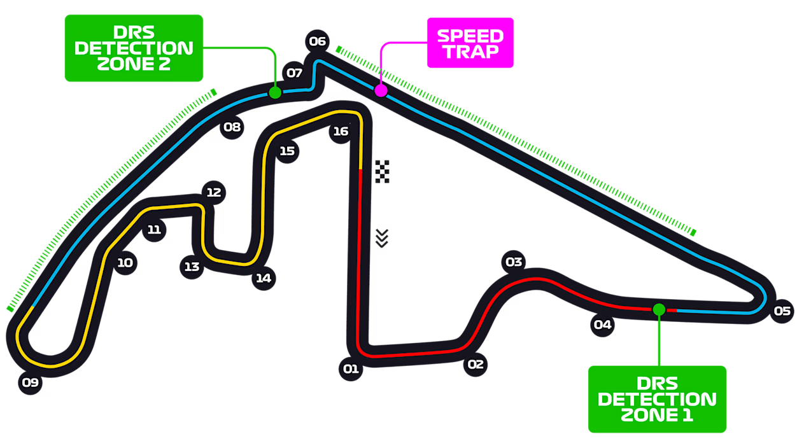

# Bayesian Analysis of F1 Telemetry and Lap Data
## UBC STAT 405 Project (Bayesian Statistics)

The RMD and PDF files for the report are available in [`stat405report.Rmd`](stat405report.Rmd) and [`stat405report.pdf`](stat405report.pdf) respectively.

### Table of Contents:

1. Project Overview
2. Repository Structure and Workflow
3. Setup and Installation

## Project Overview

We will be looking into the Telemetry and Lap data an Formula One Grand Prix. For consistency between main and backup data we will be analyzing data for the 58 Laps of the **2023 Abu Dhabi Grand Prix** held on _26 November 2023_ at the _**Yas Marina Circuit**_ in **Abu Dhabi, United Arab Emirates**.


*Yas Marina Circuit Map*

The main data is sourced from an unofficial, community-operated project, called OpenF1 API _[[1]](#data-sources/)_, that is able to access live telemetry, timing, and session data from every F1 race weekend. The backup data is sourced from Kaggle provided by user _gixarde31_  _[[2]](#data-sources/)_.

The data main data is preferred as it contains the 20 drivers, with 2 drivers per team. The backup data is limited as it only contain 5 drivers of different team.

## Setup and Installation

### Prerequisites
* Python 3.14.3
* Latest [Anaconda Distribution](https://docs.anaconda.com/anaconda/install/) or [Miniconda](https://docs.anaconda.com/miniconda/miniconda-install/) Installed
    * **NOTE:** If unsure which one to install, see [this](https://docs.anaconda.com/distro-or-miniconda/).

### Installation

#### Fork this repository:

* Navigate to the GitHub repository.
* Click on the "Fork" button in the top-right corner.
* Clone the forked repository to your local machine:
```
$ git clone https://github.com/sohbatSandhu/f1_telemetry_bayesian_analysis.git
```

#### Create Conda with required packages and Activate Environment 

```
$ conda env create -f f1bayesian_env.yml
$ conda activate f1
```

## Repository Structure and Workflow

This repository will contain the following files and folders:

The files part of the project workflow have numbering prefixes to indicate the order in which they should be executed. The files without numbering prefixes are for helpers, reference and outputs purposes.

### Python Files

The python files will be used to collect data.

- `utils.py` will be used to store helper functions for logging and error handling.
- `data_ingestion.py` will be used to request data from the OpenF1 API.
- `fetch_data.py` will be used to build datasets from data retrieved from the OpenF1 API and build appropriate dataframes for analysis.
- `01_data_collection.py` will be used as a control script to run the data collection and data fetching process.

### R Files

The R files will be used to perform data analysis and build the bayesian hierarchical model.

- `02_read_wrangle_data.R` will be used to read and wrangle the data into appropriate format for analysis.
- `03_prelim_analysis.R` will be used to perform exploratory data analysis and store outputs and visualizations in the `outputs/` and `figs/` folder.
- `04_model_prep.R` will be used to prepare data for model building and inference and store the prepared model as single `.rds` file in the `outputs/` folder.
- `05_naive_mcmc.R` will be used to run MCMC on the naive model and store the sampled values as single `.rds` file in the `outputs/fits/` folder.
- `06a_main_mcmc.R` will be used to run MCMC on the complex hierarchical model and store the sampled values as single `.rds` file in the `outputs/fits/` folder.
- `06b_main_vi.R` will be used to run Variational Inference on the complex hierarchical model and store the sampled values as single `.rds` file in the `outputs/fits/` folder.
- `07_diagnostics.R` will be used to perform diagnostics on relevant variables of the sampled values and store outputs and visualizations in the `outputs/diagnostics/` and `figs/diagnostics/` folder.

### Stan Files

The stan files will be used to specify the naive and complex hierarchical model.
- `05_naive_model.stan` will be used to specify the naive model.
- `06_main_model.stan` will be used to specify the complex hierarchical model.

### Outputs and Figures

The `outputs/` folder will be used to store all outputs from the data analysis and model building process. The `figs/` folder will be used to store all visualizations from the data analysis and modelling process.

### Data Folder

The `data/main/` folder will be used to store the raw data retrieved from the OpenF1 API and `data/backup/` will be used to store the Kaggle dataset. The `data/processed/` folder will be used to store the processed data that is ready for analysis.

## Project Workflow

### _References_

#### **Data Sources:**

1. **OpenF1** is an unofficial, community-operated project built for educational and research purposes [Link](https://openf1.org/)
2. **Kaggle Dataset:** Formula 1 2023 Abu Dhabi GP: Lap Times & Micro-Sector Telemetry [Link](https://www.kaggle.com/datasets/gixarde31/f1-2023-abu-dhabi-gp-telemetry-and-lap-data)
